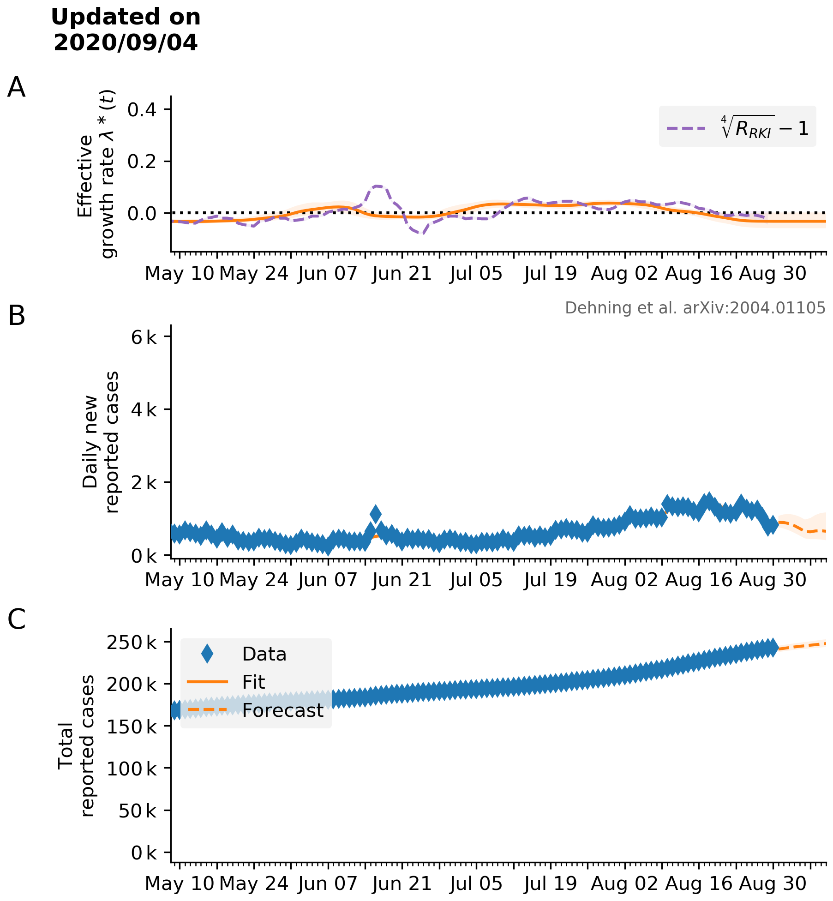
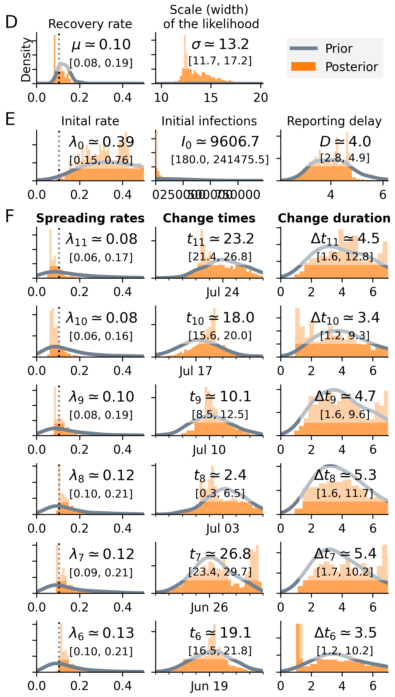
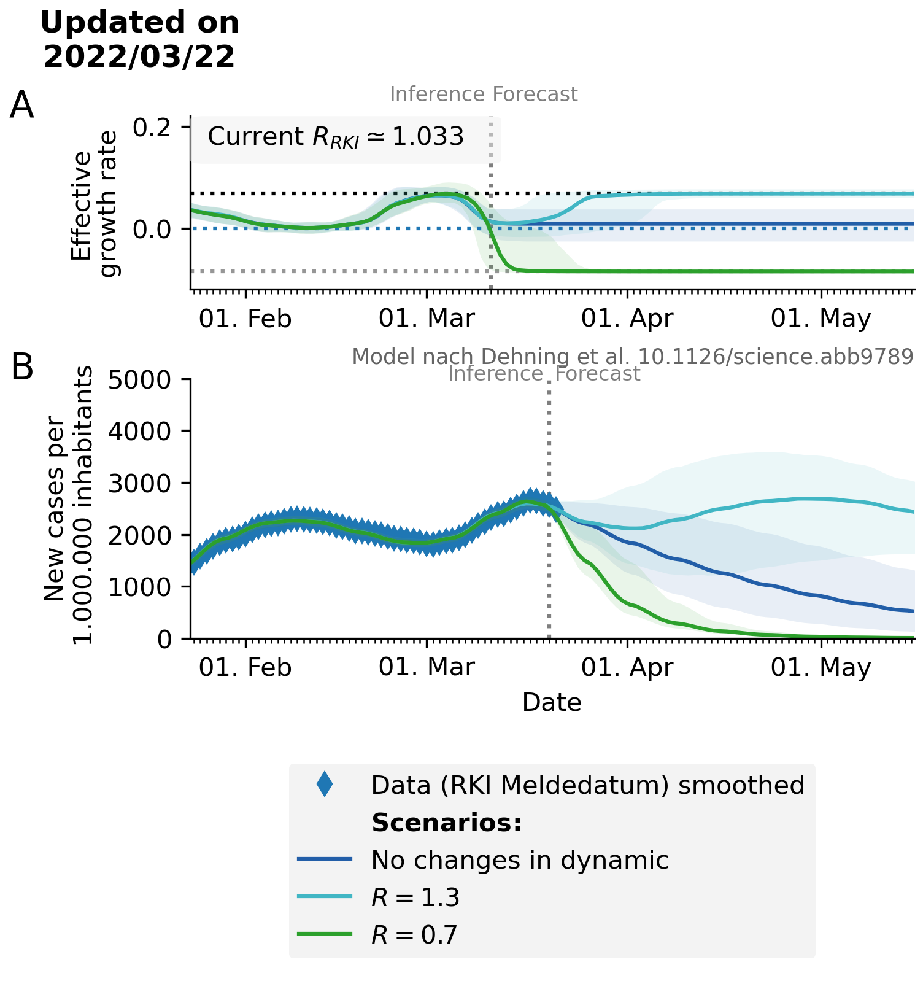
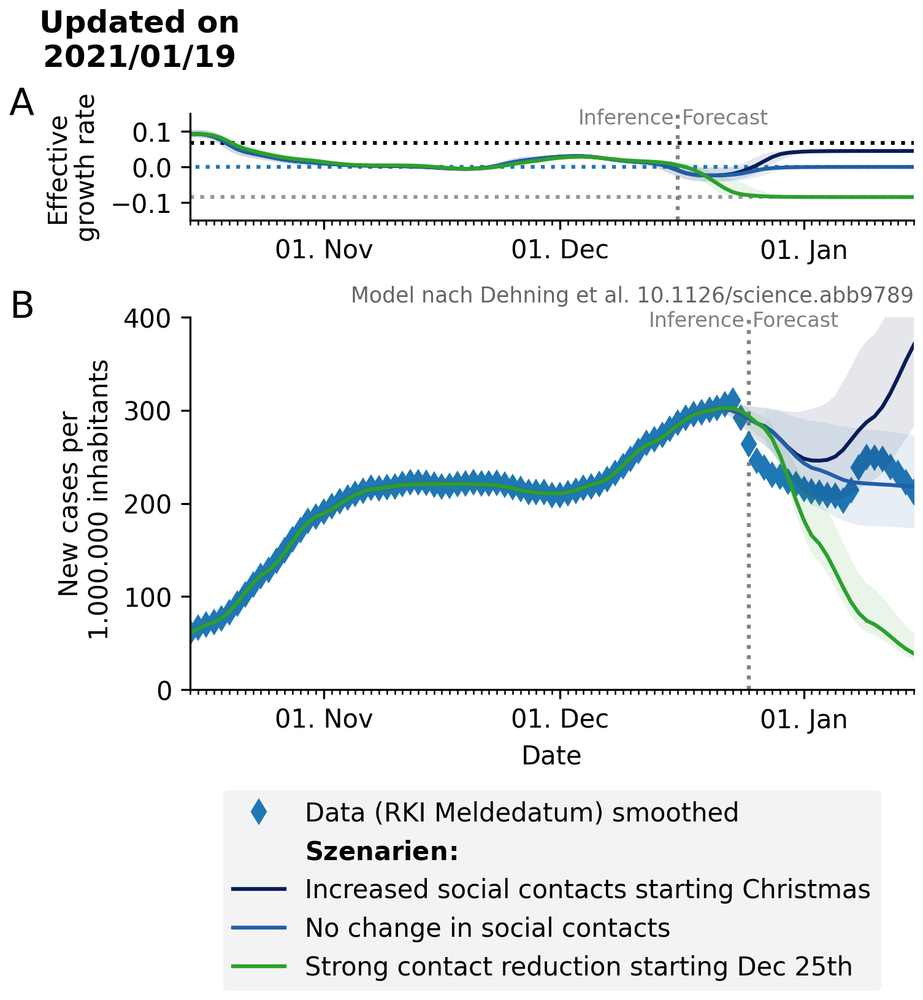
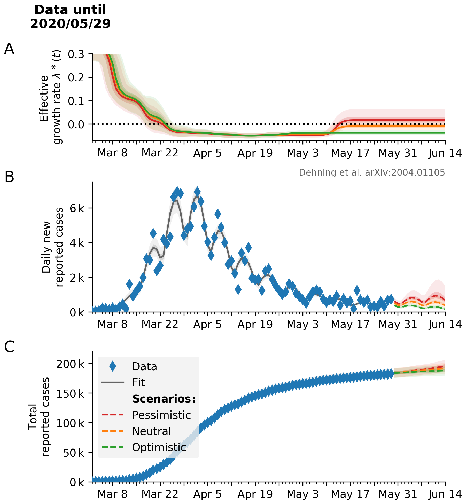
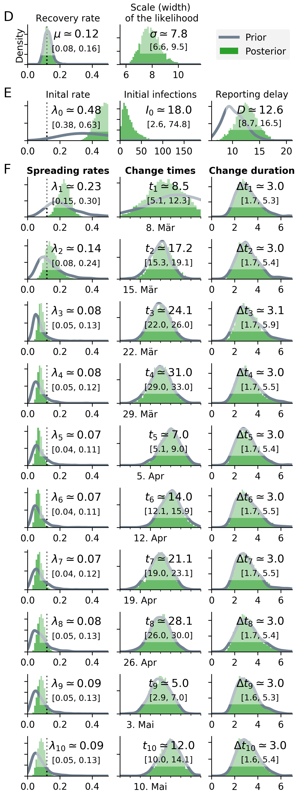
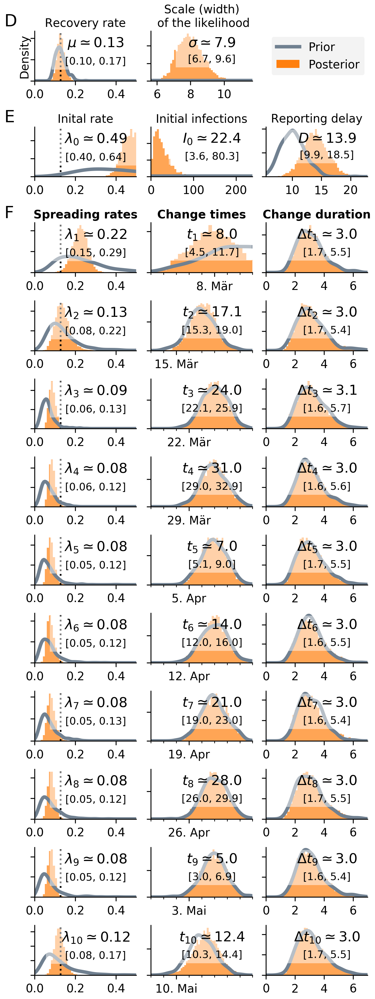
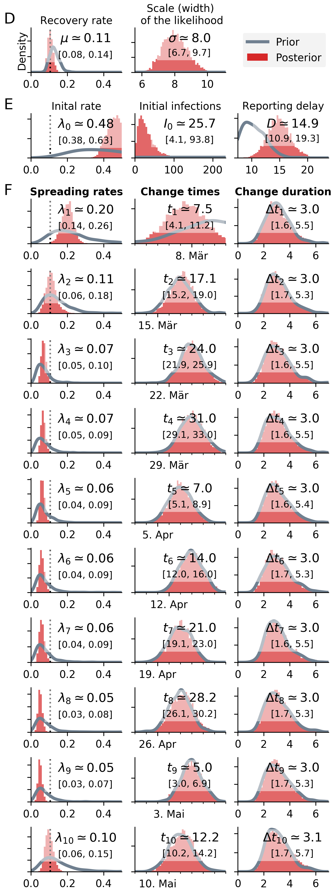

# Bayesian inference and forecast of COVID-19

* __Current code development takes place in the [new repository.](https://github.com/Priesemann-Group/covid19_inference/)__

* __The research article [is available on arXiv](https://arxiv.org/abs/2004.01105) and is in press [at Science](https://science.sciencemag.org/content/early/2020/05/14/science.abb9789). In addition we published technical notes, answering some common questions: [technical notes](technical_notes_dehning_etal_2020.pdf).__

* __Here, we keep updating figures and provide the original code for the research article.__
To get started, see [SIR_Germany_3scenarios_with_sine_weekend.ipynb](https://github.com/Priesemann-Group/covid19_inference_forecast/blob/master/scripts/paper200429/SIR_Germany_3scenarios_with_sine_weekend.ipynb), which generates Fig. 3 of the research article, and [scripts/paper200429/](https://github.com/Priesemann-Group/covid19_inference_forecast/blob/master/scripts/paper200429/), which is the directory of all scripts used for the article.
It runs e.g. in Google Colab. Requirement is PyMC3 >= 3.7.

* __Documentation is available for [this repo](https://covid19-inference-forecast.readthedocs.io/en/latest/) as well as the [new repo](https://covid19-inference.readthedocs.io/en/latest/doc/gettingstarted.html).__

* __Please take notice of our [disclaimer](disclaimer.md).__

## Daily updated scenarios

With a second wave hitting Germany and an ordered lockdown on the 2nd November, case number are more interesting than ever before. In the following we show a list of **daily** updated figures using different data sources and the same modeling approach as in our [paper](https://arxiv.org/abs/2004.01105).

Additionally there is a lightweight website developed by us to show the age dependent incidence across different regions in Germany (updates every 6 hours). The website can be access [here](https://semohr.github.io/risikogebiete_deutschland/) and was created for our [aerzteblatt paper](https://www.aerzteblatt.de/int/archive/article/216646).

### Scenario using weekly changepoints and reporting date data (OWD)

  
  

* Daily updated cases by reporting date are retrieved from [Our World in Data](https://ourworldindata.org/).

### Scenario using weekly changepoints and nowcasting data (RKI)
We recommend using plot based on reporting date above. The nowcast imputation step of the RKI doesn't take into account varying reporting delays and weekly variations in the percentage of people which report the begin of the symptoms. Both effects lead to biases in recent case numbers (see also [twitter:StefFun](https://twitter.com/StefFun/status/1325938584344555522))

  
  

                                                             
* Daily updated nowcasting data is available at the [Robert Koch Institute](https://www.rki.de/DE/Content/InfAZ/N/Neuartiges_Coronavirus/Projekte_RKI/Nowcasting_Zahlen.xlsx), but is delayed by four days to one week.

### What-if scenarios lockdown

### General
We propose three different scenarios starting today (see last updated). One with further restriction from today (R=0.7), a second one with deteriorating restrictions (R=1.2) and thridly a scenario where the underling reproduction number does not change from the current number.

  

#### Data until 2nd February
Around chirstmas and new year one can clearly see that the reporting was not working as effectifly as before or afterwards. Our model is able to bridge this behaviour if enought data before and afterwards is given.

  

#### Data until 25th December
Instead of further thougher restrictions around the 14th of December we proposed a lockdown right after Christmas on the 25th November.

  

#### Data until 2nd November
With a second lockdown (light) present in Germany from the 2nd November onwards, we try to model three different lockdown scenarios.

  

Until Nov. 1, the R-value was about 1.3.
In order for the case numbers to decrease rapidly, it must be lowered to R=0.7.

We extrapolate three scenarios:
(Red) The lockdown on November 2 has no effect.
(Orange) A mild lockdown, with a resulting reproduction number of 1.0 and
(green) a strict lockdown with a resulting reproduction number of 0.7, thus as effective as in spring.
The current development (blue data points) suggests that the lockdown is "mild", i.e. not sufficient to reduce the case numbers.
To reduce the case numbers, not only does an R below 1 need to be achieved, but the R must be well below 1, for example at 0.7 as in spring. Otherwise, the case numbers decrease only very slowly.

The discrepancy between data (blue) and prediction (yellow) may be due to (a) the application of stricter test criteria (there are not enough tests for all suspect cases), and (b) the fact that the change in behavior was implemented before November 1. The lockdown was probably already partially implemented before it was prescribed.

## Modeling forecast scenarios in Germany (updated figures of the [paper](https://arxiv.org/abs/2004.01105))

Our aim is to quantify the effects of intervention policies on the spread of COVID-19. To that end, we built a Bayesian SIR model where we can incorporate our prior knowledge of the time points of governmental policy changes. While the first two change points were not sufficient to switch from growth of novel cases to a decline, the third change point (the strict contact ban initiated around March 23) brought this crucial reversal. - Now, a number of stores have been opened and policies have been loosened on the one hand, which may lead to increased spreading (increased ). On the other hand, masks are now widely used and contact tracing might start to show effect, which both may reduce the spread of the virus (decrease ). We will only start to see the joint effects of the novel govenrmental policies and collective behavior with a delay of 2-3 weeks. Therefore, we show alternative future scenarios here.

### Alternative forecast scenarios, projecting the relaxation of restrictions on May 11

  

  
  
  

  * If the effective growth rate stays on the current (all-time low) value, new cases will further decrease (green). A low number of new daily cases might bring a full control of the spread within reach ([see our position paper by the four German research associations](https://www.mpg.de/14759871/corona-stellungnahme); [Endorsement](https://www.mpg.de/14760439/28-04-2020_Stellungnahme_Teil_01.pdf); [Position paper](https://www.mpg.de/14760439/28-04-2020_Stellungnahme_Teil_02.pdf)).

  * If the relaxation of restrictions causes an increase in effective growth rate above zero, the daily new reported cases will increase again (red).

The current scenarios are based on the model that incorporates weekly reporting modulation (less cases reported on weekends).

### Scenario focus on three change points

  
  

### Scenario assuming three change points with a weekly modulation of reported cases

  
  

### What if
What if the growth would have continued with less change points?

We fitted the four scenarios to the number of new cases until respectively March 18th, March 25th, April 1st and April 7th.

This figure was used widely in German media, including TV, to illustrate the magnitude of the different change points.

