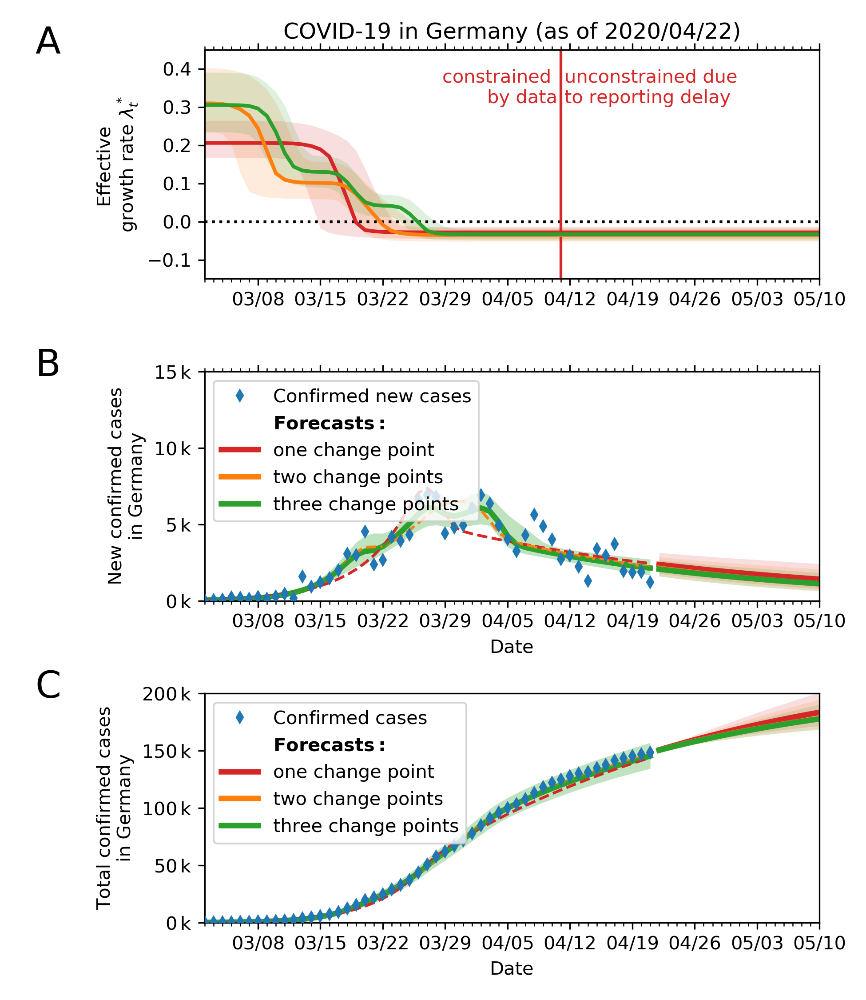

# Bayesian inference and forecast of COVID-19

We want to quantify the effect of new policies on the spread of COVID-19. Crucially, fitting an exponential function to the number of cases lacks an interpretability of the fitting error. We built a Bayesian SIR model where we can incorporate our prior knowledge of the time points of governmental policy changes. At the example of Germany, we show that the two kinks in the last weeks correspond to two changes of policies, leading to a growth rate of about 0 now.

The research article [is available on arXiv](https://arxiv.org/abs/2004.01105) (**updated on April 13**).

The code used to produce the figures is available [here](https://github.com/Priesemann-Group/covid19_inference_forecast/blob/master/scripts/paper/Corona_germany_simple_model.ipynb) (simple model) and [here](https://github.com/Priesemann-Group/covid19_inference_forecast/blob/master/scripts/paper/SIR_with_delay_Germany_3scenarios.ipynb) (with change points).
It is runnable in Google Colab. Requirement is PyMC3 >= 3.7.

If you want to use the code, we recommend to look at our [documentation](https://covid19-inference-forecast.readthedocs.io/en/latest/).

**We are looking for support** to help us with analyzing other countries and to extend to an hierarchical regional model. We might get additional funding for that. If you have missed the first meeting: Everyone is welcome to join our information session on Zoom on Tuesday 21th at 13:00. We will publish the Zoom address here on Tuesday at 12:00. 

We are continuing to develop our code in a new repository [here](https://github.com/Priesemann-Group/covid19_inference/), but it is not in working state yet. The code used for the paper and the figures will stay here. 

Some output figures are shown below. The rest are found in the figures folder. We update them regularly.

### Please take notice of our [disclaimer](disclaimer.md).

## Modeling three different scenarios in Germany (updated figures of the paper)

### Summary

### Scenario assuming three change points

  
   

### Scenario assuming three change points with a weekly modulation of reported cases

  
  

## What-if scenarios

What if the growth would have continued with less change points?

We fitted the four scenarios to the number of new cases until respectively March 18th, March 25th, April 1st and April 7th.

