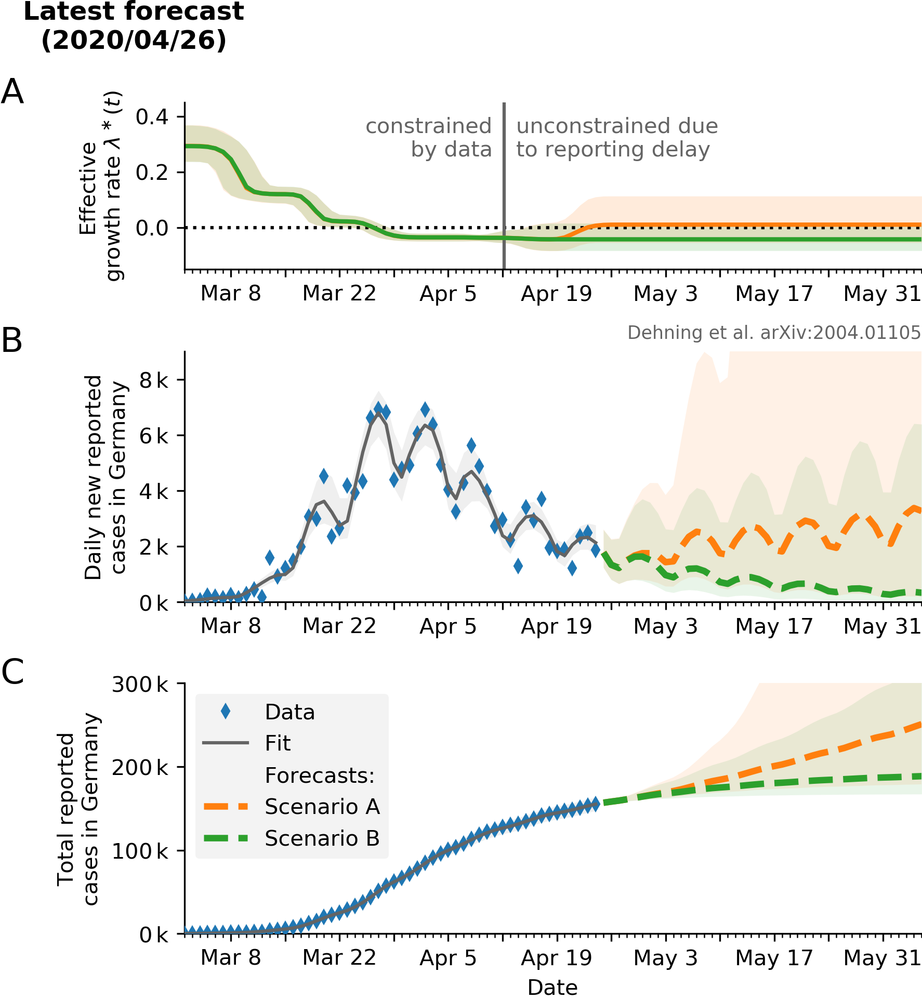
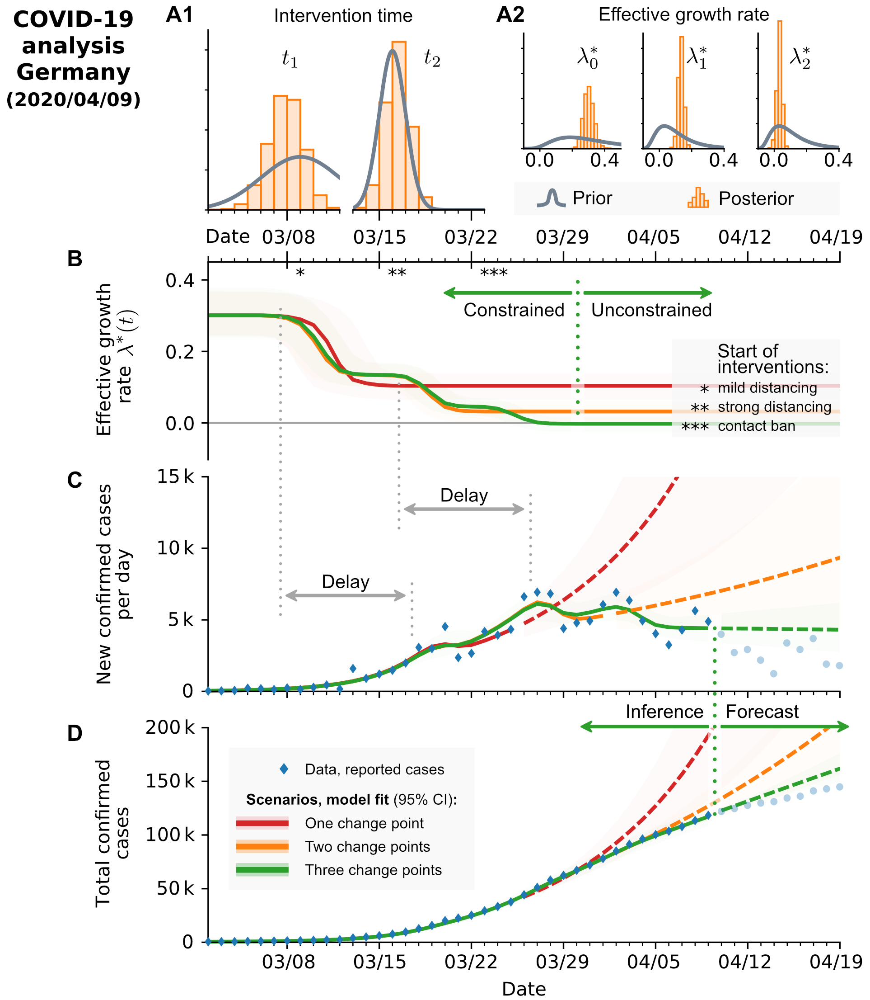

# Bayesian inference and forecast of COVID-19

* __Current code development takes place in the [new repository.](https://github.com/Priesemann-Group/covid19_inference/)__

* __Here, we keep updating figures and provide the original paper code.__
See [Corona_germany_simple_model.ipynb](https://github.com/Priesemann-Group/covid19_inference_forecast/blob/master/scripts/paper/Corona_germany_simple_model.ipynb) (simple model) and [SIR_with_delay_Germany_3scenarios.ipynb](https://github.com/Priesemann-Group/covid19_inference_forecast/blob/master/scripts/paper/SIR_with_delay_Germany_3scenarios.ipynb) (with change points).
It is runnable in Google Colab. Requirement is PyMC3 >= 3.7.

* __The research article [is available on arXiv](https://arxiv.org/abs/2004.01105) (updated on April 13).__

* __Documentation is available for [this repo](https://covid19-inference-forecast.readthedocs.io/en/latest/) as well as the [new repo](https://covid19-inference.readthedocs.io/en/latest/doc/gettingstarted.html).__

* __Please take notice of our [disclaimer](disclaimer.md).__

## Modeling forecast scenarios in Germany (updated figures of the paper)

We want to quantify the effect of new policies on the spread of COVID-19. Crucially, fitting an exponential function to the number of cases lacks an interpretability of the fitting error. We built a Bayesian SIR model where we can incorporate our prior knowledge of the time points of governmental policy changes. At the example of Germany, we show that the two kinks in the last weeks correspond to two changes of policies, leading to a growth rate of about 0 now.

### Summary

  
   

__Left:__ Two scenarios from the model with weekend correction (less cases reported on weekends).
  * __A__: If the relaxation of restrictions causes even a mild increase in effective growth rate, the daily new reported cases will increase again.
  * __B__: If the effective growth rate stays on the current (all-time low) value, we could achive 1 000 daily new cases by the end of May.
  
__Right:__ Original figure from the paper (as of April 9), when three change points well described the data. Note the reporting delay - it hinders an immediate evaluation of the effectiveness of any intervention.

### Scenario assuming three change points

  
   

### Scenario assuming three change points with a weekly modulation of reported cases

  
  

## What-if scenarios

What if the growth would have continued with less change points?

We fitted the four scenarios to the number of new cases until respectively March 18th, March 25th, April 1st and April 7th.

