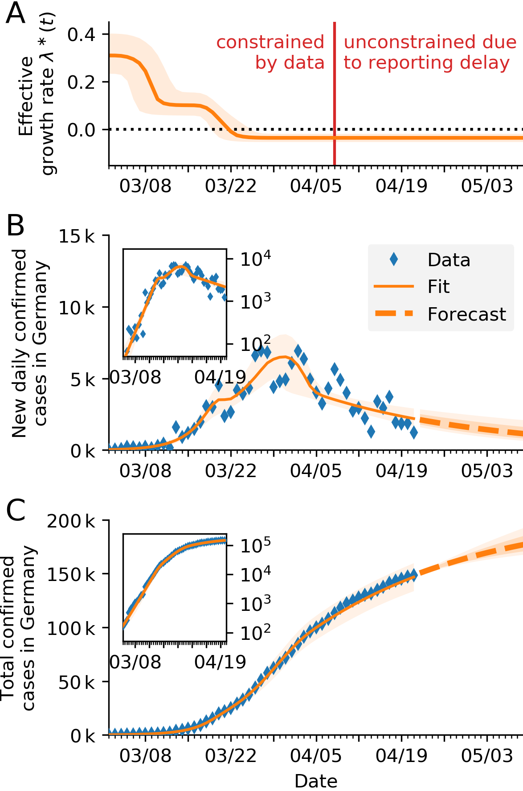
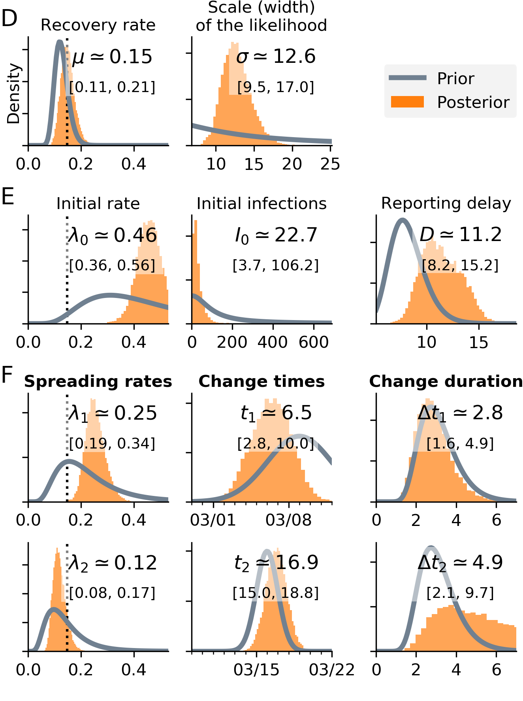
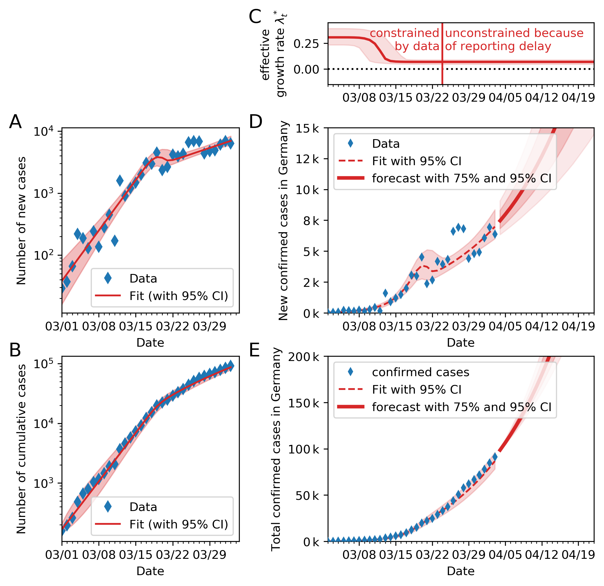
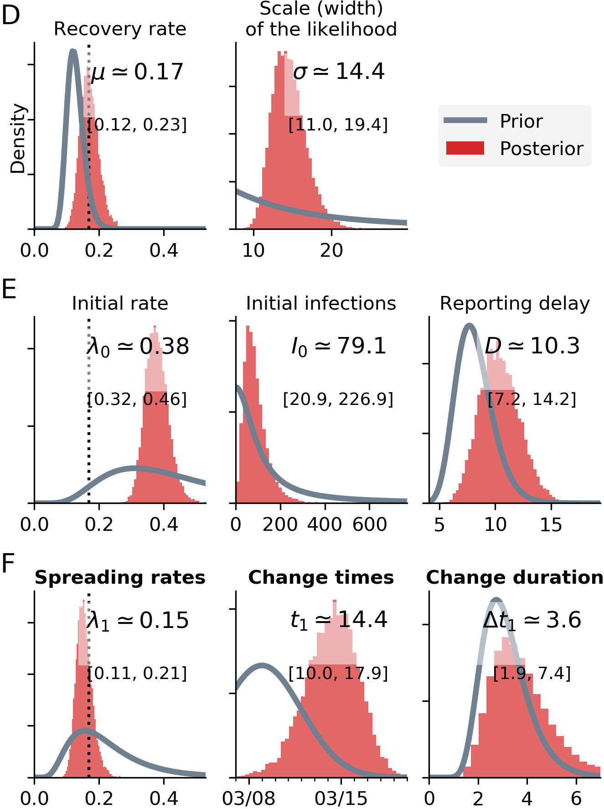

# Bayesian inference and forecast of COVID-19

We want to quantify the effect of new policies on the spread of COVID-19. Crucially, fitting an exponential function to the number of cases lacks an interpretability of the fitting error. We built a Bayesian SIR model where we can incorporate our prior knowledge of the time points of governmental policy changes. At the example of Germany, we show that the two kinks in the last weeks correspond to two changes of policies, leading to a growth rate of about 0 now.

The research article [is available on arXiv](https://arxiv.org/abs/2004.01105).

The code used to produce the figures is available [here](https://github.com/Priesemann-Group/covid19_inference_forecast/blob/master/Corona_germany_simple_model.ipynb) (simple model) and [here](https://github.com/Priesemann-Group/covid19_inference_forecast/blob/master/scripts/SIR_with_delay_Germany_3scenarios.ipynb) (with change points).
It is runnable in Google Colab. Requirement is PyMC3 >= 3.7.

If you want to use the code, we recommend to look at our [documentation](https://covid19-inference-forecast.readthedocs.io/en/latest/).

Some output figures are shown below. The rest are found in the figures folder. We update them regularly.

### Please take notice of our [disclaimer](disclaimer.md).

## Modeling three different scenarios in Germany

### Summary

### Scenario assuming three change points

### Scenario assuming two change points

### Scenario assuming one change point

