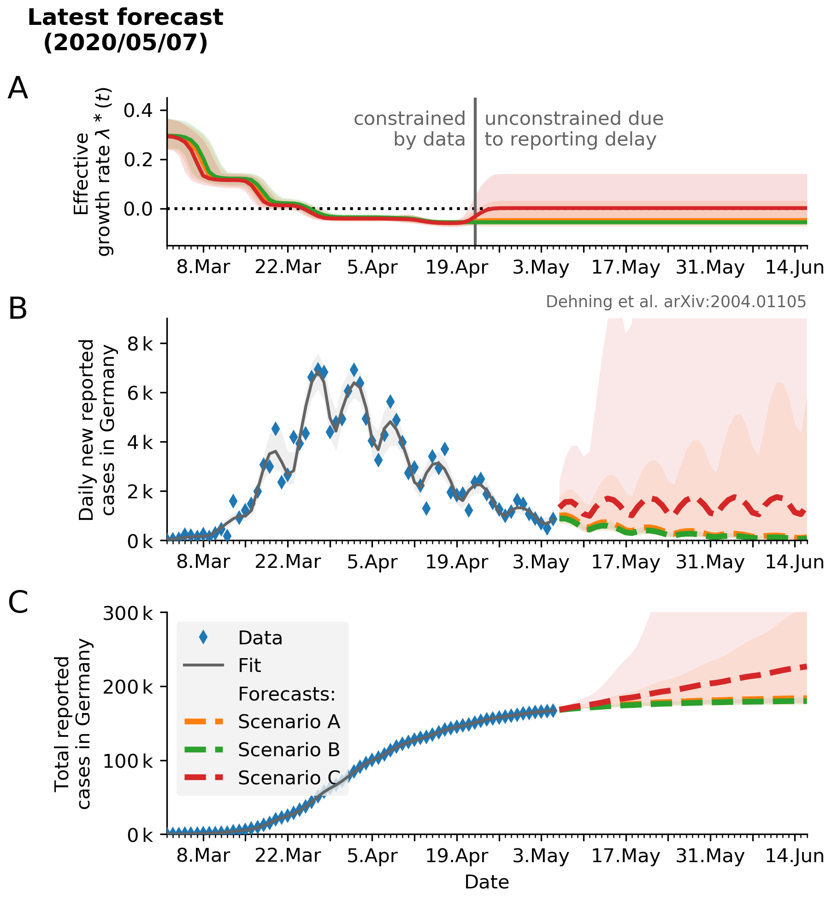
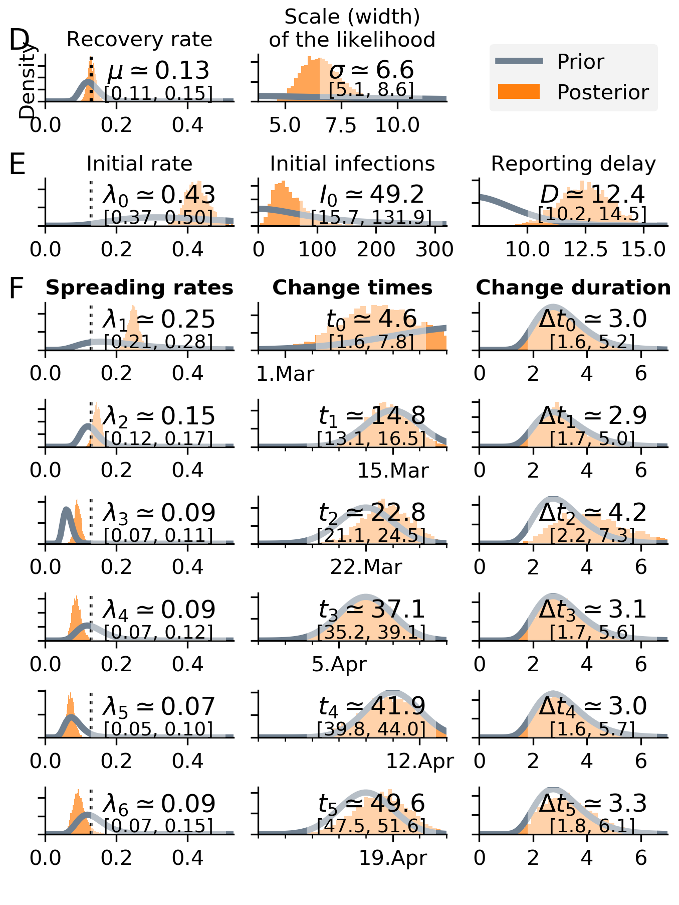
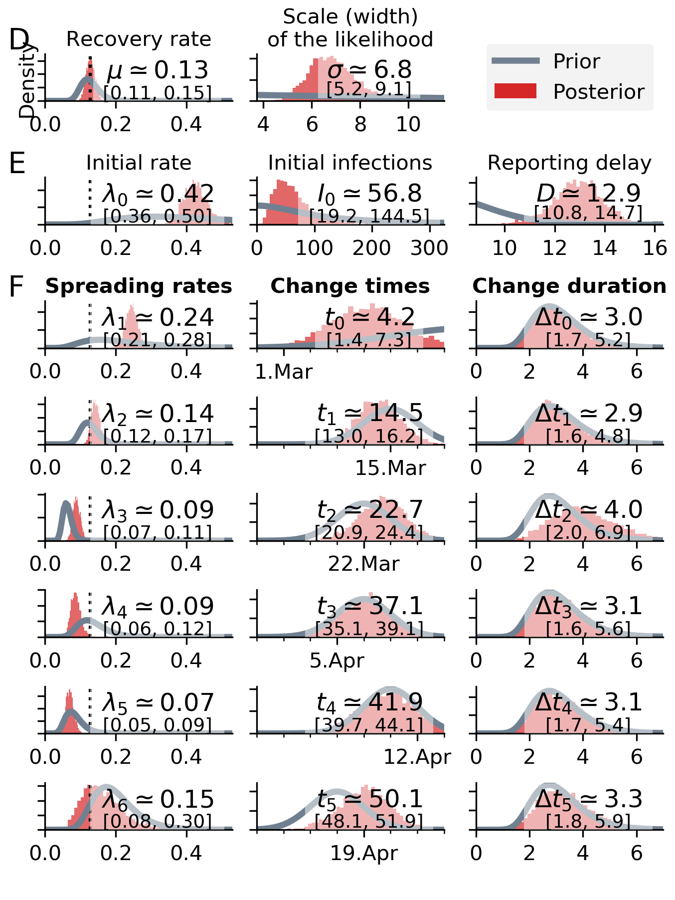
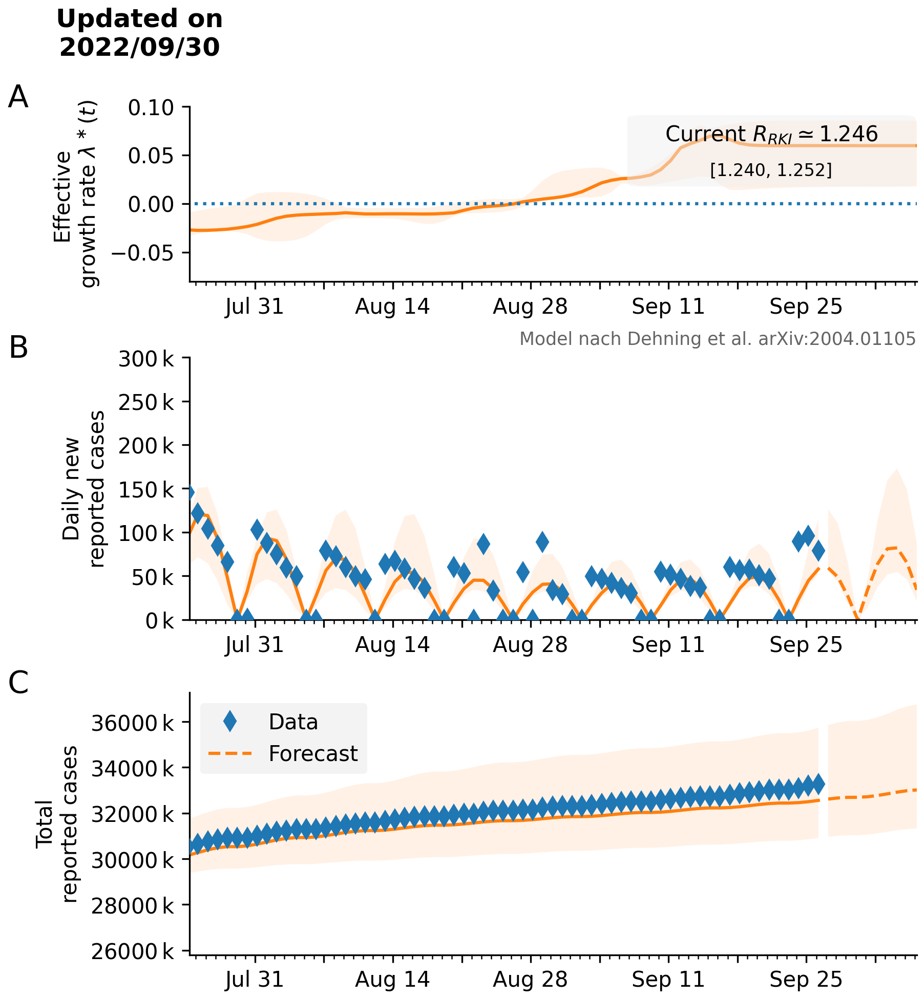
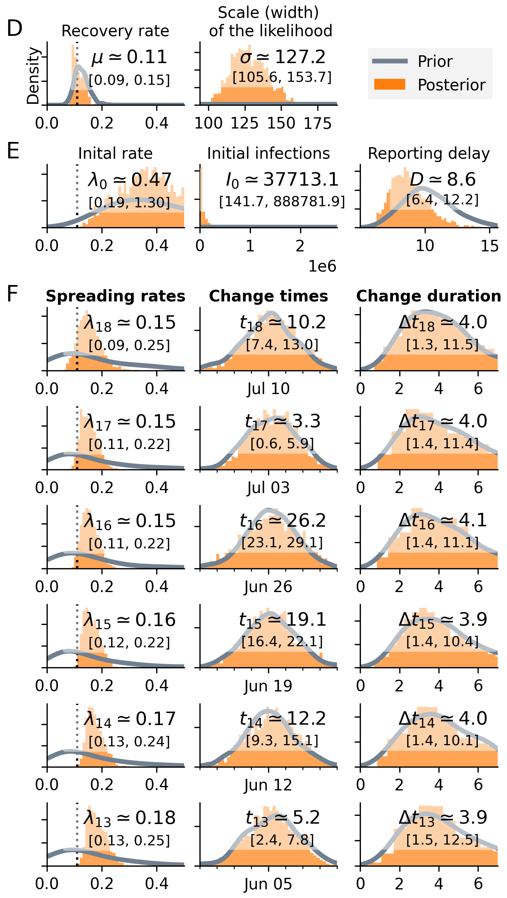
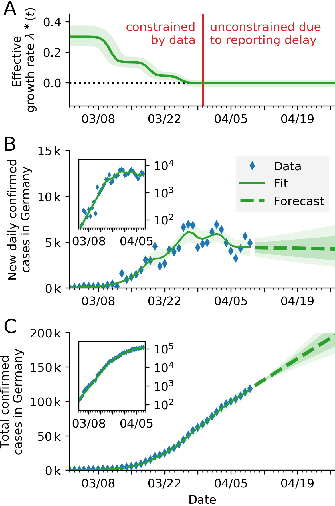
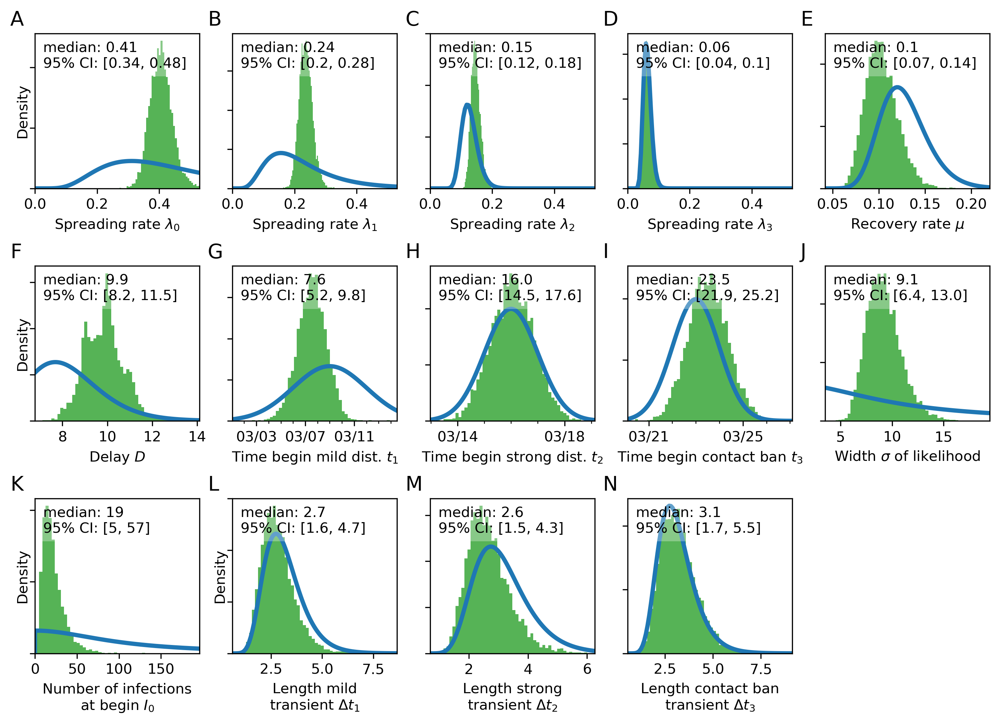
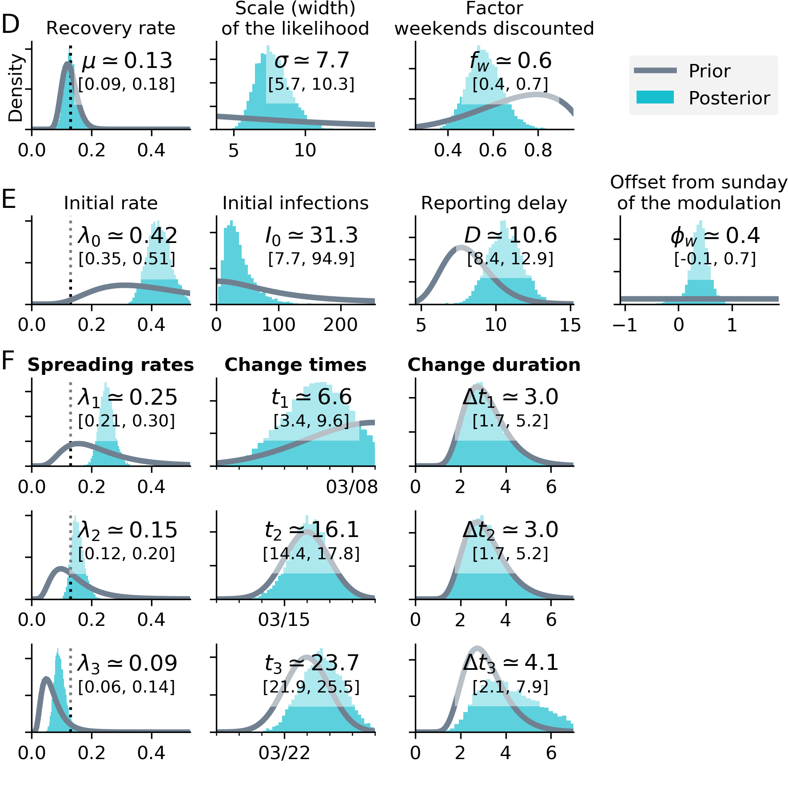

# Bayesian inference and forecast of COVID-19

* __Current code development takes place in the [new repository.](https://github.com/Priesemann-Group/covid19_inference/)__

* __Updated figures are in the current [master](https://github.com/Priesemann-Group/covid19_inference_forecast/)__

* __Here, we provide the original paper code.__
see [SIR_Germany_3scenarios_with_sine_weekend.ipynb](https://github.com/Priesemann-Group/covid19_inference_forecast/blob/master/scripts/paper200429/SIR_Germany_3scenarios_with_sine_weekend.ipynb) (for Fig. 3) and [scripts/paper200429/](https://github.com/Priesemann-Group/covid19_inference_forecast/blob/master/scripts/paper200429/) (the directory of all scripts used for the paper).
It is runnable in Google Colab. Requirement is PyMC3 >= 3.7.

* __The research article [is available on arXiv](https://arxiv.org/abs/2004.01105).__

* __Documentation is available for [this repo](https://covid19-inference-forecast.readthedocs.io/en/latest/) as well as the [new repo](https://covid19-inference.readthedocs.io/en/latest/doc/gettingstarted.html).__

* __Please take notice of our [disclaimer](disclaimer.md).__

## Modeling forecast scenarios in Germany (updated figures of the [paper](https://arxiv.org/abs/2004.01105))

Our aim is to quantify the effects of intervention policies on the spread of COVID-19. To that end, we built a Bayesian SIR model where we can incorporate our prior knowledge of the time points of governmental policy changes. While the first two change points were not sufficient to switch from growth of novel cases to a decline, the third change point (the strict contact ban initiated around March 23) brought this crucial reversal. - Now, since April 19, a number of stores have been opened and policies have been loosened on the one hand, which may lead to increased spreading (increased ). On the other hand, masks are now widely used and contact tracing might start to show effect, which both may reduce the spread of the virus (decrease ). We will only start to see the joint effects of the novel govenrmental policies and collective behavior with a delay of 2-3 weeks. Therefore, we show alternative future scenarios here.

### Alternative forecast scenarios, projecting the relaxation of restrictions on April 19

  * If the effective growth rate stays on the current (all-time low) value, new cases will further decrease. A low number of new daily cases might bring a full control of the spread within reach ([see our position paper by the four German research associations](https://www.mpg.de/14759871/corona-stellungnahme); [Endorsement](https://www.mpg.de/14760439/28-04-2020_Stellungnahme_Teil_01.pdf); [Position paper](https://www.mpg.de/14760439/28-04-2020_Stellungnahme_Teil_02.pdf)).
  
  * If the relaxation of restrictions causes an increase in effective growth rate $\lambda^\ast$ above zero, the daily new reported cases will increase again.

The current scenarios are based on the model that incorporates weekly reporting modulation (less cases reported on weekends).
The distributions below display to the parameters the produce the time series. 

  
   

### Scenario with a weekly new change point

  
   

### Scenario focus on three change points

  
   

### Scenario assuming three change points with a weekly modulation of reported cases

  
  

## What-if scenarios

What if the growth would have continued with less change points?

We fitted the four scenarios to the number of new cases until respectively March 18th, March 25th, April 1st and April 7th.

This figure was used widely in German media, including TV, to illustrate the magnitude of the different change points.

