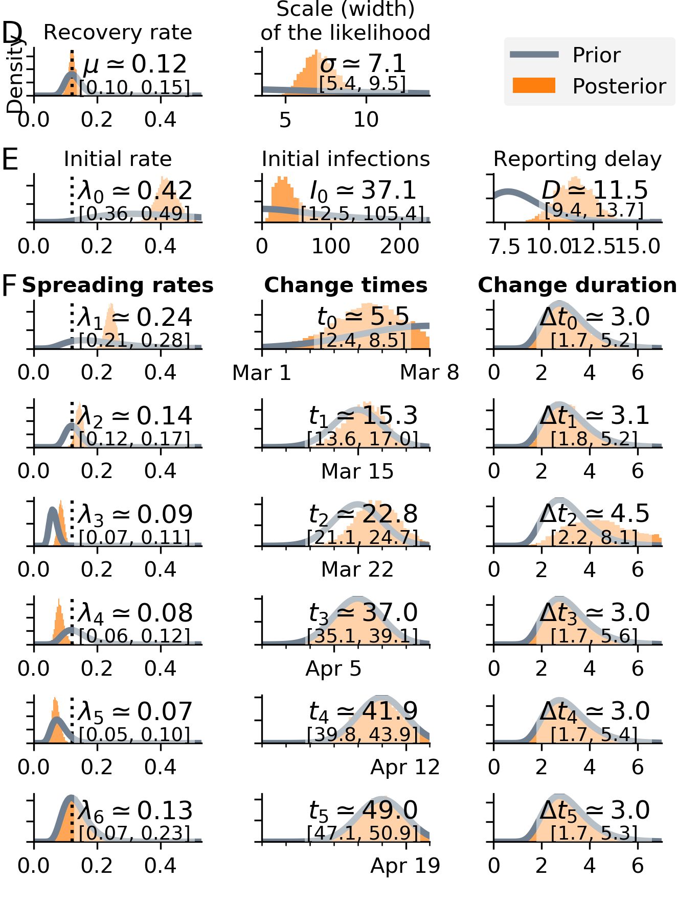
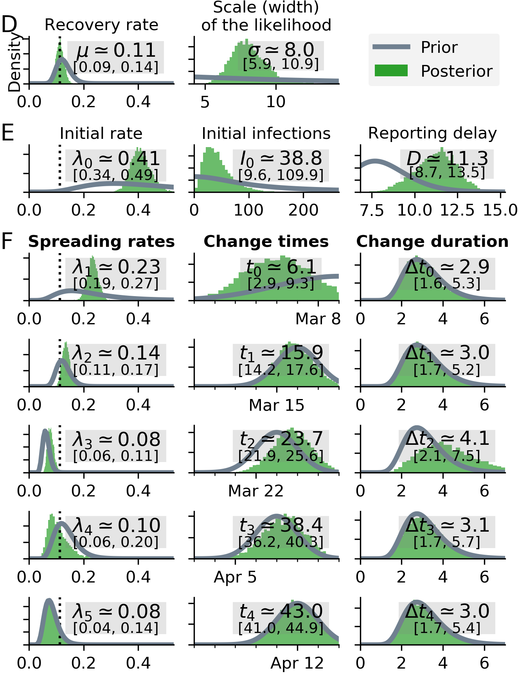

# Bayesian inference and forecast of COVID-19

* __Current code development takes place in the [new repository.](https://github.com/Priesemann-Group/covid19_inference/)__

* __Here, we keep updating figures and provide the original paper code.__
For the paper revised on 2020/04/29
see [SIR_with_delay_Germany_without_sine_weekend.ipynb](https://github.com/Priesemann-Group/covid19_inference_forecast/blob/master/scripts/paper200429/SIR_with_delay_Germany_without_sine_weekend.ipynb) (for Fig. 3) and [scripts/paper200429/](https://github.com/Priesemann-Group/covid19_inference_forecast/blob/master/scripts/paper200429/) (the directory of all scripts used for the paper).
It is runnable in Google Colab. Requirement is PyMC3 >= 3.7.

* __The research article [is available on arXiv](https://arxiv.org/abs/2004.01105) (updated on April 13).__

* __Documentation is available for [this repo](https://covid19-inference-forecast.readthedocs.io/en/latest/) as well as the [new repo](https://covid19-inference.readthedocs.io/en/latest/doc/gettingstarted.html).__

* __Please take notice of our [disclaimer](disclaimer.md).__

## Modeling forecast scenarios in Germany (updated figures of the paper)

We want to quantify the effect of new policies on the spread of COVID-19. Crucially, fitting an exponential function to the number of cases lacks an interpretability of the fitting error. We built a Bayesian SIR model where we can incorporate our prior knowledge of the time points of governmental policy changes. While the first two change points were not sufficient to switch from growth of novel cases to a decline, the third change point (the strict contact ban initiated around March 23) brought this crucial reversal.

### Latest forecast due to the relaxation of the restrictions on April 19

  * __Scenario A__: If the relaxation of restrictions causes even a mild increase in effective growth rate, the daily new reported cases will increase again.
  * __Scenario B__: If the effective growth rate stays on the current (all-time low) value, we could achive 1 000 daily new cases by the end of May.

The two current scenarios are based on the model with weekend correction (less cases reported on weekends).
The distributions below correspond to the parameters the produce the time series. 

  
   

### Past forecast as of April 9, comparing one, two and three change-point scenarios

 

Original figure from the paper (with forecasts as of April 9), when three change points well described the data. Current data points were added for a comparison with the real-world outcome, but they were not considered by the model.

* Note that, at the time of the forecasts (April 9), the third change point was still very recent (March 23). Clearly, the time difference exceeds the estimated reporting delay (~10 days) and enough data to determine the change point _should_ have been available. However, the model understimated the positive effect the last change point, which resulted in an overestimation of new cases.

* While the observed data points are still close to the 95% confidence interval of the forecast (shaded green region, note that the confidence interval does not include observation noise), the overestimation of new cases in the forecast stresses the importance of the reporting delay - it hinders an immediate evaluation of an intervention.

### Scenario focus on three change points

  
   

### Scenario assuming three change points with a weekly modulation of reported cases

  
  

## What-if scenarios

What if the growth would have continued with less change points?

We fitted the four scenarios to the number of new cases until respectively March 18th, March 25th, April 1st and April 7th.

